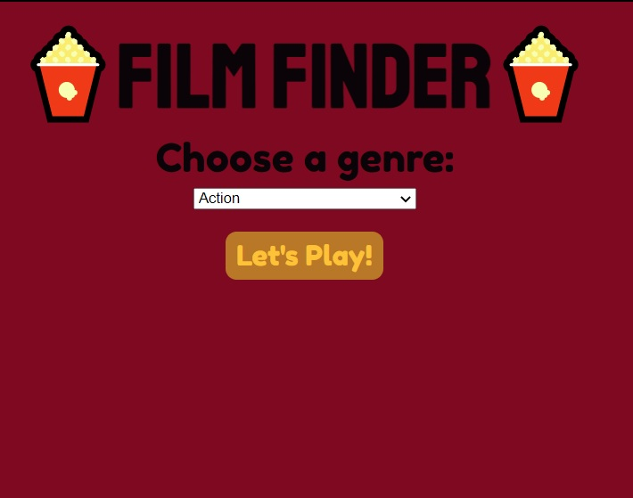

# Challenge Project: Film Finder

## General Info

>*You’ve caught up on your list of TV shows and movies and want to get recommendations for what to watch next, but aren’t sure where to look. In this project, you’ll use your knowledge of HTTP requests and asynchronous JavaScript to create a movie discovery app that will recommend random movies by genre. You’ll be able to choose from several genres, and like or dislike a movie to get another suggestion.*

----

A project for connecting API to a website. Intended for practise of using promises, requests, asynchronous actions and error handling.

This project is only coding for API fetch, rest of code is provided from Codecademy

This project is part of Codecademy front end course.

## Technologies
- Promises
- Asynchronous Javascript Promises Callbacks
- Requests

## Launch
Could be launch with Node.js.